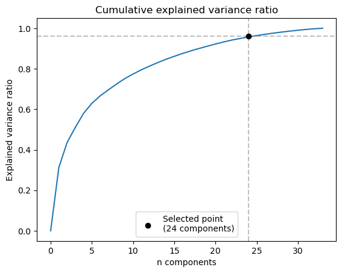
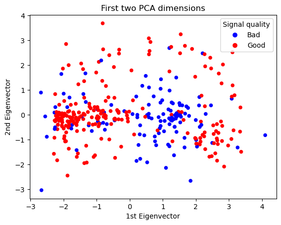
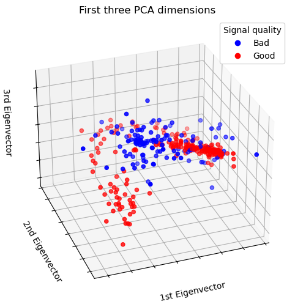
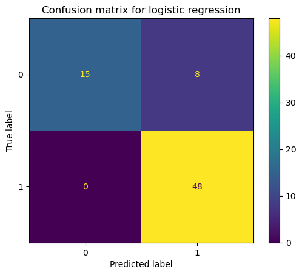
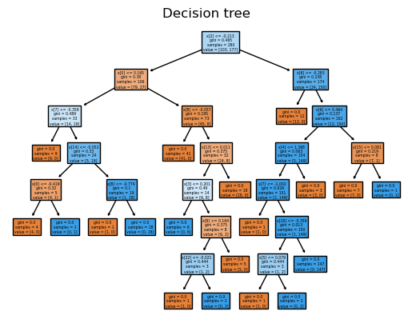
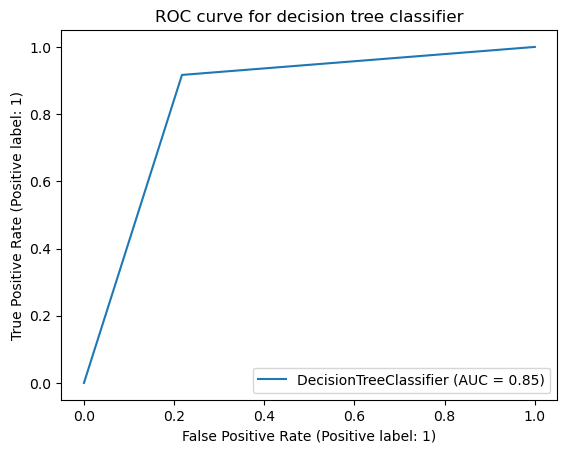

# Signal Quality Prediction with Ionosphere Dataset
Sierra Stevenson
## Introduction

The ionosphere is the layer of the Earth's atmosphere with a significant concentration of particles charged via radiation, particularly from the sun. Shortwave (high frequency) radio waves emitted from the Earth are reflected by the charged ions and electrions within the ionosphere back towards the Earth, rather than be sent out to space.

I retrieved data from the UC Irvine Machine Learning Repository at [this link](https://archive.ics.uci.edu/dataset/52/ionosphere]). The data was collected by a radar system in Goose Bay, Labrador, affiliated with the Space Physics Group of The Johns Hopkins University Applied Physics Laboratory. The radar system consists of 16 high frequency antennas which transmit a multi-pulse pattern to the ionosphere and, between pulses, measure the phase shift of the returns.

The paper behind the dataset, [Sigillito et al. (1989)](https://secwww.jhuapl.edu/techdigest/Content/techdigest/pdf/V10-N03/10-03-Sigillito_Class.pdf), uses the following equations to denote the received signal at time t, C(t), and the autocorrelation function R(t,k) as:


where T is the pulse repetition period, k is the pulse number from 0 to 16, and C‾ is the complex conjugate of C.

Because the signal is complex, the autocorrelation function is also complex. The dataset consists of 17 pairs of numbers; 17 corresponding real and imaginary components of the autocorrelation function. In signal processing, a real part of a received signal corresponds to the component of the signal that lies in-phase with the reference signal (in our case, the original pulse) and the imaginary component lies orthogonal to it.
Prior to the publication, filtering out noisy signals was a labor-intensive task for researchers, but the use of machine learning allows for the process to be automated with high accuracy. 

The paper compared single- and multilayered feedforward neural networks to produce their results. They achieved an accuracy of 98% with the multilayer neural network and 92% with the single-layer network.

## Project Overview
For my project, I wanted to compare a variety of classical machine learning techniques to determine which prove most effective for such a task, and compare their results to the neural networks implemented in the paper. Since each signal return is classified in the dataset as either "good" or "bad," this is a binary classification task. Each feature of the data — in this case, each of the 17 real or 17 imaginary parts of the autocorrelation function from a certain pulse — is labeled only as Attribute1, Attribute 2, etc, so there is little opportunity for reviewing the data on a humanistic basis before running quantitative analytical tools.

Before proceeding with the models, two important characteristics of the dataset should be considered. First, the nature of the 34 features (as being components of functions representing a signal return) calls one to spend time analyzing their relative contributions. One would expected several dependencies between the features to emerge, which could have adverse effects on prediction. This leads to the next and most important point to consider: overfitting. The dataset is small — formed from only 350 observation instances, so extra precautions must be taken to prevent overfitting, including dimensionality reduction and feature ranking.

I will perform the following:

1. PCA for dimension reduction
2. A series of models:
    *   Logistic regression with regularization
    *   Decision tree
    *   Random forest classification model
    * SVM model as an alternative model setup

After the creation of the models in Section 3, I will use a random forest feature ranking technique to reduce the features (the principal components found in Section 1) in each model. Then I will obtain representative scores from the optimized models and compare them to a final model, SVM, which I hypothesize to perform better than the others using a radial basis kernel.

# 1. Principal Component Analysis
I performed principal component analysis (PCA) on the dataset. PCA is a tool used to reduce the dimensionality of the dataset. The ionosphere dataset has 34 features, but their paired character and nature as parts of the autocorrelation function suggest that they aren't entirely independent from one another. 

PCA works by analyzing correlations between the different features using a covariance matrix, and then producing "principal components" via calculating the eigenvectors of the matrix. Essentially, it is seeking to create dimensions that most explain the target value's variance.

<br>*Figure 1. Running sum of explained variance ratio per principal component.*

In Figure 1, I graphed the running sum of each successive component's explained variance ratio below. 95%+ variance is explained by a sum of 24 components. I chose to limit my target cumulative explained variance ratio to a 95% threshold, rather than 100% (and use all available components), because I wanted to prevent my model from overfitting.

I used the 24 features produced by PCA to create the classification models described in the next section.

To investigate the dataset and its new dimensions further, I plotted the first 2 and 3 dimensionos produced by PCA, as the explained variance ratio per component had a monotonically decreasing trajectory, where the first 3 dimensions had a much higher relative contribution.

<br>*Figure 2. Scatterplot of first and second principal components and associated target values (red indicates a "bad" signal return, and blue indicates a "good" signal return).*

Visual inspection of Figure 2 suggests that the first principal component has strong predictive potential, but this assumption will be tested and quantified in Section 3 when I perform a feature ranking on the principal components of the dataset.

<br>*Figure 3. Scatterplot of first, second, and third principal components and associated target values (red indicates a "bad" signal return, and blue indicates a "good" signal return).*

In Figure 3, the first principal component still appears to be most significant, but the data also appears to vary based on their radial length from some central point. This leads me to test in Section 4 a model utilizing a radial basis: SVM.


# 2. Models
In regression tasks, the target values may be continuous. In classification tasks, the target values are discrete and categorical in nature. Since the ionosphere dataset target values are either "g", denoting a good signal, or "b", denoting a bad signal, this is a binary classification task. Therefore, I chose to perform and compare models that are best suited for classifying data.

## 2a. Logistic Regression
Logistic regression is well-suited for binary classification as it predicts a discrete target variable. I performed a logistic regressionon the dataset using the code below:

```python
from sklearn.linear_model import LogisticRegression

lr = LogisticRegression(max_iter=50) # This dataset converges very quickly! Increasing the number of iterations does not increase the accuracy.

# train
lr.fit(x_train,y_train)

# calculate the score when predicting the test data:
score = lr.score(x_test,y_test)
```
This returns a score of <b>88.73%</b>, which does not quite meet the accuracy of the paper's single-layer neural network (92%). However, for a preliminary run this is a great start! In the figure below I plot the confusion matrix.

<br>*Figure 4. Confusion matrix for logistic regression model.*

It can be read from Figure 4 that the model produces the following:

| True negatives 	| False negatives 	| True positives 	| False positives 	|
|----------------	|-----------------	|----------------	|-----------------	|
| 15             	| 0               	| 48             	| 8               	|


Interestingly, false positives occur much more frequently than false negatives, which are not produced at all in this test set, likely due to the relatively lower frequency in which negative ("bad") target values appear in the training set in the first place.

## 2b. Decision Tree Classifier
Decision trees can be used as classifiers by measuring the GINI impurity, which is defined in class as "a measure of how often a randomly chosen element from the set would be incorrectly labeled if it was randomly labeled according ot the distribution of labels in the subset." In other words, the decision tree splits with the goal of minimizing the probability of randomly placing each data point into the wrong class. I decided to use a decision tree for this data set because I am building on an interest in feature ranking and wanted to compare the methodology of a decision tree to the other models. Even though the features are essentially unlabeled, I plotted the decision tree to obtain a visualization of which features played the largest roles in the structure of the decision tree (Figure 5).

Because the dataset is quite small, I wanted to ensure that I wasn't accidentally overfitting my model. I used sklearn's `GridSearchCV()` to find the optimal depth for the model, which was computed to be 7.

<br>*Figure 5. Diagram of decision tree classifier for ionosphere dataset. Blue shading indicates that the data leans towards a "good" prediction, and red indicates more data points with target values of "bad", with stronger coloring associated with the data aligning more uniformly with the good or bad classification.*

I was surprised that the decision tree splits off the third and fourth principal components, rather than the first and second. However, the explainability of variance that the principal components decreasingly provide does not necessarily imply an equivalent ratio of predictive power, so this decision tree setup is not indicative of any errors in implementation.

Figure 6 is a receiver operating characteristic (ROC) curve for my decision tree classifer, which plots the true positive rate against the false positive rate.

<br>*Figure 6. ROC curve for decision tree classifer.*

If the tolerance for false positive values is greater than or equal to 0.2, the true positive rate exceeds 0.8.

Overall, the decision tree classifier performs with an accuracy score of <b>93.0%</b>, which outperforms both my logistic regression model and the single-layer neural network created by Sigillito et al.

## 2c. Random Forest Classification
For similar reasoning to creating a decision tree as outlined in Section 2b, I wanted to implement a random forest classification model and learn if it improves upon the overall score generated by a single tree.

As with the other models, I used scikit-learn to create and train a random forest classifiction model, and I ran `GridSearchCV()` to find the ideal depth, which was equal to 5.

This is the code used to create the optimal RandomForestClassifier model:

```python
from sklearn.ensemble import RandomForestClassifier

rf = RandomForestClassifier()
rf_clf = GridSearchCV(rf, param_grid={'max_depth' : range(100)})
rf_clf.fit(x_train, y_train)
```
The random forest classifier created has a score of <b>96.8%</b>, which is a high level accuracy close to what Sigillito et al. reached with their multilayer neural network.


## 2d. Support Vector Machine for Classification
Based on the exploration of principal component contributions described in Section 1, I hypothesized that a support vector machine (SVM) classifier with a radial basis function would perform the most accurately among my models. I ran the following code to test different kernel types for SVM:

```python
from sklearn.model_selection import cross_val_score
from sklearn import svm

# Compare different kernel types for SVM
print("Cross validation scores:")
for kernel in ["linear", "poly", "rbf", "sigmoid"]:
    svm_clf = svm.SVC(kernel=kernel, random_state=0)
    svm_clf.fit(x_train, y_train)
    scores = cross_val_score(svm_clf, x_test, y_test)
    print(kernel+"\n\t%0.2f with a standard deviation of %0.2f\n" % (scores.mean(), scores.std()))
```
*Output:*
```
Cross validation scores:
linear
	0.84 with a standard deviation of 0.03

poly
	0.73 with a standard deviation of 0.07

rbf
	0.93 with a standard deviation of 0.04

sigmoid
	0.79 with a standard deviation of 0.06
```
Clearly, the radial basis function (rbf) outperforms the other kernels in cross-validation score, but now we need to determine its true score. These comparisons were computed with the default regularization parameter, C = 1, but I wanted to investigate the possibility of the existence of better values for C.

Once again, I used scikit-learn's `GridSearchCV()` to iterate through and compare different values for C to determine the optimal value.

```python
s = svm.SVC()
s_clf = GridSearchCV(s, param_grid={'C' : range(20), 'kernel' : ["linear", "poly", "rbf", "sigmoid"]})
s_clf.fit(x_train, y_train)
print("CV score: ", s_clf.best_score_)
print("Optimal parameters: ", s_clf.best_params_)
```
*Output:*
```
CV score:  0.95
Optimal parameters:  {'C': 3, 'kernel': 'rbf'}
```

It should be noted that I did not define kernel in the generic SVM estimator before running `GridSearchCV()` on it, as I wanted to validate the code I wrote in the previous code block. There was agreement as scikit-learn presented radial basis functions as the optimal kernel. It also found C = 3 to be the optimal regularization parameter, which indicates a reduced regularization scheme as being conducive to a better model.

I then fit the resulting best estimator to the training data and obtained a score of **91.5%**, which outperforms the logistic regression model but not the decision tree or random forest classifiers.

# Conclusion
On a dataset measuring signal returns from the ionosphere, I performed PCA and compared four different binary classification models.

A summary of the results is below, with the model types implemented in Sigillito et al. on the left and the models I implemented on the right:

| Single-layer neural network 	| Multilayer neural network 	| — 	| Logistic regression 	| Decision tree 	| Random forest 	| Support vector machine 	|
|-----------------------------	|---------------------------	|---	|---------------------	|---------------	|---------------	|------------------------	|
| 92%                         	| 98%                       	| — 	| 88.73%              	| 93.0%         	| 96.8%         	| 91.5%                  	|

In summary, none of my models were able to outperform the multilayer neural network from the paper, but I was able to outperform the single-layer neural network using a random forest classifier optimized using scikit-learn's `GridSearchCV`, a cross-validation tool that resamples from the training set to find the optimal set of parameters. In the future, applying a neural network directly and modifying the parameters would make for an interesting comparison, especially given that the paper was written in 1989. Modern libraries may provide more tools allowing for an even greater accuracy.

# References
McElroy, Michael B.. "ionosphere and magnetosphere". Encyclopedia Britannica, 24 Apr. 2023, https://www.britannica.com/science/ionosphere-and-magnetosphere. Accessed 8 December 2023.
Sigillito,V., Wing,S., Hutton,L., and Baker,K.. (1989). Ionosphere. UCI Machine Learning Repository. https://doi.org/10.24432/C5W01B.


This project was completed by Sierra Stevenson for AOS C204 at UCLA.
